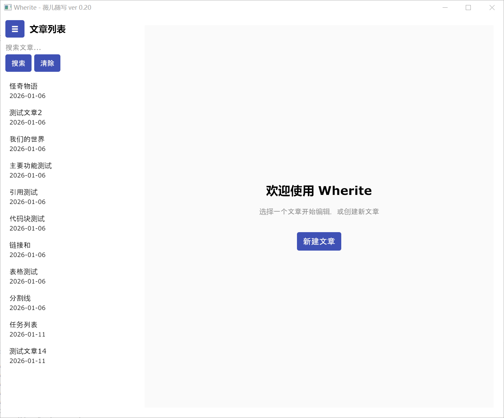

# Wherite - 薇儿随写

**当前版本: ver 0.20**


## 项目简介

Wherite（薇儿随写）是一个基于 SQLite 数据库的本地文章管理系统，支持文章的查询、新建、编辑、删除，提供 Markdown 实时预览、语法高亮、主题切换等功能，采用纯 Go 技术栈实现跨平台支持。

## 目录

- [项目简介](#项目简介)
- [功能特性](#功能特性)
  - [文章管理](#文章管理)
  - [Markdown 编辑](#markdown-编辑)
  - [用户体验优化](#用户体验优化)
- [技术栈](#技术栈)
  - [前端（GUI 界面）](#前端gui-界面)
  - [后端（Go 核心逻辑）](#后端go-核心逻辑)
  - [数据存储](#数据存储)
- [安装与运行](#安装与运行)
  - [前置要求](#前置要求)
  - [快速启动](#快速启动)
- [项目结构](#项目结构)
- [数据库结构](#数据库结构)
- [使用说明](#使用说明)
  - [基本操作](#基本操作)
  - [快捷键](#快捷键)
- [版本历史](#版本历史)
- [许可证](#许可证)
- [维护者](#维护者)
- [常见问题](#常见问题)
- [联系方式](#联系方式)

## 项目展示



## 功能特性

### 文章管理

- 📝 **新建文章**：自动生成自增 ID，快速创建新文章
- ✏️ **编辑文章**：支持 Markdown 语法的富文本编辑
- 🗑️ **删除文章**：带确认对话框，防止误操作
- 🔄 **文章重命名**：支持修改文章标题
- 🔍 **文章搜索**：按标题和内容搜索文章，快速定位

### Markdown 编辑

- 📊 **实时预览**：Markdown 语法实时渲染预览
- 🎨 **语法高亮**：标题、粗体、斜体、代码块等高亮显示
- 💻 **代码高亮**：支持多种编程语言的代码块语法高亮
- 📋 **表格支持**：GFM 表格语法支持
- ~~**删除线**~~：支持删除线语法
- ✅ **任务列表**：支持任务列表语法，管理待办事项

### 用户体验优化

- 📱 **响应式设计**：适配不同屏幕尺寸
- 📂 **可折叠侧边栏**：节省空间，专注编辑
- 🔍 **搜索功能**：快速搜索文章内容
- ⚠️ **未保存提示**：实时提醒未保存的更改
- 🚨 **删除确认**：删除前的确认对话框
- 👨‍💻 **友好界面**：现代化的图形用户界面

## 技术栈

### 前端（GUI 界面）

- **Gio**: 版本号 0.9.0+ - 纯 Go 图形界面框架，提供窗口、组件、事件处理

### 后端（Go 核心逻辑）

- **Go**: 版本号 1.25.4+ - 项目主语言
- **Goldmark**: 版本号 1.7.15 - Markdown 解析库，支持 CommonMark 和 GFM 标准

### 数据存储

- **SQLite3**: 版本号 3 - 本地数据库，存储文章、分类、标签、图片等信息
- **modernc.org/sqlite**: 版本号 1.26.0 - 纯 Go SQLite 驱动，无需 CGO 依赖

## 安装与运行

### 前置要求

- Go 1.25.4 或更高版本

### 快速启动

```bash
# 1. 克隆项目
git clone https://github.com/pyapple12/wherite.git
cd wherite

# 2. 编译程序
# Windows（无控制台窗口）
go build -o wherite.exe -ldflags="-H windowsgui"

# Windows（带控制台窗口）
go build -o wherite.exe

# Linux/macOS
go build -o wherite

# 3. 运行程序
# Windows
.\wherite.exe

# Linux/macOS
./wherite
```

## 项目结构

```
wherite/
├── workingboard/                 工作板文档
│   ├── 1. Overview.md            项目概述
│   ├── 2. Missions.md            任务列表
│   ├── 3. Problems.md            问题集
│   ├── 4. FurtherPlans.md        路线图
│   ├── 5. Archive.md             归档任务
│   ├── 6. Commands.md            命令文档
│   └── Guidelines/               指南文档
│       └── GitHub_README_Guide.md
├── wherite_main.go               主入口文件
├── wherite_gui.go                图形界面模块
├── wherite_database.go           数据库操作模块
├── wherite_markdown.go           Markdown 解析模块
├── wherite_syntax.go             语法高亮模块
├── go.mod                        Go 模块依赖管理
├── go.sum                        依赖校验文件
├── wherite.sqlite3               SQLite 数据库文件
└── README.md                     项目说明文档
```

## 数据库结构

### articles 表

| 字段       | 类型    | 说明       |
| ---------- | ------- | ---------- |
| id         | INTEGER | 主键，自增 |
| title      | TEXT    | 文章标题   |
| content    | TEXT    | 文章内容   |
| created_at | TEXT    | 创建时间   |
| updated_at | TEXT    | 更新时间   |

## 使用说明

### 基本操作

1. **运行程序**：双击 `wherite.exe`（Windows）或运行 `./wherite`（Linux/macOS）
2. **创建文章**：点击"新建"按钮，输入标题和内容，点击"保存"
3. **编辑文章**：在左侧列表中点击文章，在右侧编辑区域修改内容
4. **搜索文章**：在搜索框中输入关键词，点击"搜索"按钮
5. **删除文章**：点击"删除"按钮，在确认对话框中点击"确认删除"

### 快捷键

- 在搜索框中按回车键直接搜索
- 点击文章列表项快速切换到对应文章
- 所有输入框支持文本选择和复制粘贴
- 内容输入框支持多行文本编辑

## 版本历史

### ver 0.20

- 🚨 新增删除确认对话框，防止误操作
- ⚠️ 优化用户体验，添加未保存状态提示
- 🔧 完善错误处理机制
- 📊 优化数据库操作，确保数据一致性
- ⚡ 提升界面响应速度

### ver 0.06

- 实现文章列表显示，包含标题、创建时间和摘要
- 添加文章搜索功能，支持按标题和内容搜索
- 增强用户界面，添加搜索等工具栏按钮

### ver 0.05

- 新增"新建"按钮，支持创建新文章
- 创建新文章后自动生成自增 ID
- 实现新建和编辑两种保存模式
- 添加成功提示信息反馈
- 优化错误处理和用户体验

### ver 0.04 模块化拆分版

- 实现代码模块化拆分，分离关注点
- 创建 `wherite_main.go` 作为主入口程序
- 创建 `wherite_gui.go` 作为图形界面模块
- 创建 `wherite_database.go` 作为数据库操作模块
- 建立清晰的模块间通信架构
- 保持功能完整性，提高代码可维护性

### ver 0.03 图形化实验版

- 实现完整的图形用户界面
- 集成 Gio GUI 框架
- 实现文章内容的实时编辑功能
- 添加保存按钮和数据库更新功能
- 优化界面布局和用户体验
- 完善错误处理和用户反馈

### ver 0.02 GUI 过渡版本

- 集成 Gio GUI 框架
- 实现基础图形界面布局
- 完成文章查询的图形化操作
- 解决 CGO 依赖问题

### ver 0.01 技术先行版本

- 实现基础数据库连接功能
- 实现文章查询功能
- 实现命令行交互界面
- 完成输入验证和错误处理

## 许可证

本项目基于 [GPL-3.0 许可证](./LICENSE) 开源。

## 维护者

- **pyapple12** - 项目作者
- **GitHub 仓库**: https://github.com/pyapple12/wherite.git

## 常见问题

### Q1：如何备份数据库？

A：数据库文件 `wherite.sqlite3` 包含所有数据，您可以直接复制该文件进行备份。

### Q2：程序支持哪些平台？

A：支持 Windows、Linux 和 macOS 平台，纯 Go 实现，无需额外依赖。

### Q3：如何导出文章？

A：当前版本支持复制文章内容，后续版本将添加导出功能。

## 联系方式

如有问题或建议，欢迎通过 GitHub Issue 反馈。
